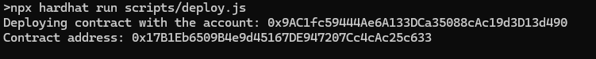

In this tutorial, we'll develop a simple Hello World smart contract that stores and retrieves a message in a smart contract deployed on the Core blockchain TestNet. 

This tutorial is from [Core's Official Tutorial Repository](https://github.com/coredao-org/dapp-tutorial).

## Learning Takeaways
This tutorial will help you gain knowledge on the following learning points:

* MetaMask Wallet connectivity to Core Testnet;
* Smart contract development and deployment on Core Testnet;
* Read data from a smart contract;
* Write data to a smart contract;

## Software Prerequisites
* [Git](https://git-scm.com/) v2.44.0
* [Node.js](https://nodejs.org/en) v20.11.1
* [npm](https://docs.npmjs.com/downloading-and-installing-node-js-and-npm) v10.2.4
* [Hardhat](https://hardhat.org/hardhat-runner/docs/getting-started#installation) v2.22.7
* [MetaMask Web Wallet Extension](https://metamask.io/download/)

## Setting up the development environment

1. Create a new directory for the project and navigate into it

```bash
mkdir hello-world-dapp
cd hello-world-dapp
```
2. Install Hardhat

```bash
npm init --yes
npm install --save-dev hardhat
```
3. Initialize Hardhat project by running the following command

```bash
npx hardhat init
```


4. Once this project is initialized, you'll find the following project structure:

```bash
hello-world-dapp
|   .gitignore
|   hardhat-config.js 
|   package-lock.json
|   package.json
|   README.md
| 
+---contracts 
|       Lock.sol
|       
+---ignition 
|   \---modules
|           Lock.js
|                 
+---node_modules
|  
+---test 
|       Lock.js       
|       
```

5. Install and configure MetaMask Chrome Extension to use with Core Testnet. Refer [here](https://docs.coredao.org/docs/Dev-Guide/core-testnet-wallet-config) for a detailed guide.

6. Create a secret.json file in the root folder and store the private key of your MetaMask wallet in it. Refer [here](https://metamask.zendesk.com/hc/en-us/articles/360015290032-How-to-reveal-your-Secret-Recovery-Phrase) for details on how to get MetaMask account's private key.

```json
{"PrivateKey":"you private key, do not leak this file, do keep it absolutely safe"}
```

> Do not forget to add this file to the `.gitignore` file in the root folder of your project so that you don't accidentally check your private keys/secret phrases into a public repository. Make sure you keep this file in an absolutely safe place!

7. Copy the following into your `hardhat.config.js` file

```js
require("@nomicfoundation/hardhat-toolbox");

/** @type import('hardhat/config').HardhatUserConfig */

const { PrivateKey } = require('./secret.json');
module.exports = {
  defaultNetwork: 'core_testnet',

  networks: {
     hardhat: {
     },
     core_testnet: {
        url: 'https://rpc.test.btcs.network',
        accounts: [PrivateKey],
        chainId: 1115,
     }
  },
  solidity: {
     compilers: [
       {
          version: '0.8.26',
          settings: {
             evmVersion: 'paris',
             optimizer: {
                enabled: true,
                runs: 200,
             },
          },
       },
     ],
  },
  paths: {
     sources: './contracts',
     cache: './cache',
     artifacts: './artifacts',
  },
  mocha: {
     timeout: 60000,
  },
};
```

## Writing HelloWorld Smart Contract

1. Navigate to the `contracts` folder in the root directory of your project.
2. Delete the `Lock.sol` file; create a new file `HelloWorld.sol` and paste the following contents into it.

```javascript
// SPDX-License-Identifier: MIT
pragma solidity ^0.8.26;

contract HelloWorld {
    string public message;

    constructor(string memory _message) {
        message = _message;
    }

    function setMessage(string memory _message) public {
        message = _message;
    }
}

```
### Explanation
The `HelloWorld` Solidity contract stores a message in a public string variable. It initializes this message through the constructor when the contract is deployed. The `setMessage` function allows anyone to update the stored message. The `public` keyword makes the `message` variable readable by anyone.

#### State Variable
* `string public message`: Public string variable to store and read a message.
#### Constructor
* `constructor(string memory _message) { message = _message; }`: Initializes the message state variable with a value provided during deployment.
#### Function
* `function setMessage(string memory _message) public { message = _message; }`: Allows updating the message state variable.

## Compiling Smart Contract

1. To compile the `HelloWorld` smart contract defined in the `HelloWorld.sol`, from the root directory run the following command

```bash
npx hardhat compile
```

## Testing HelloWorld Smart Contracts

1. Before deploying your smart contract on the Core blockchain, it is best adviced to first run a series of tests making sure that the smart contract is working as desired. 

2. Inside the `test` folder, delete the `Lock.js` file, create a new file `HelloWorld.js` and update it with the following:

```javascript
const { expect } = require("chai");

describe("HelloWorld contract", function () {
  let HelloWorld;
  let helloWorld;
  let owner;

  beforeEach(async function () {
    HelloWorld = await ethers.getContractFactory("HelloWorld");
    [owner] = await ethers.getSigners();
    helloWorld = await HelloWorld.deploy("Hello, world!");
    await helloWorld.waitForDeployment(); 
  });

  it("Should return the initial message", async function () {
    expect(await helloWorld.message()).to.equal("Hello, world!");
  });

  it("Should update the message", async function () {
    const tx =await helloWorld.setMessage("Hello, Hardhat!");
    await tx.wait(); // Wait for the transaction to be mined
    expect(await helloWorld.message()).to.equal("Hello, Hardhat!");
  });
});
```

### Explanation
This test script is designed to validate the behavior of the HelloWorld smart contract. In the setup phase (beforeEach), it deploys a new instance of the contract with the initial message "Hello, world!" and waits for the deployment to complete.

The first test, "Should return the initial message," checks that the contract correctly returns the initial message stored during deployment. It ensures that the message is set to "Hello, world!" as expected.

The second test, "Should update the message," updates the message to "Hello, Hardhat!" and then verifies that the message has been updated successfully by checking its new value. This ensures that the setMessage function works correctly and the contract's state is updated as intended.

This test script checks the functionality of the HelloWorld contract:

* **Setup:** It deploys the HelloWorld contract with the initial message "Hello, world!" before each test.
* **Test Initial Message:** It verifies that the contract's initial message is correctly set to "Hello, world!".
* **Test Update Message:** It updates the message to "Hello, Hardhat!" and confirms that the change is successfully reflected.

Overall, these tests confirm that the contract's functionality for setting and retrieving messages operates correctly.

3. Run the test scripts using the command `npx hardhat test` 


## Deploying HelloWorld Smart Contract 

1. Create a `scripts` folder in the root directory of your project. Inside this folder, create a file `deploy.js`; paste the following script into it.

```javascript
const { ethers } = require("hardhat");

async function main() {
  const [deployer] = await ethers.getSigners();

  console.log("Deploying contract with the account:", deployer.address);

  const HelloWorld = await ethers.getContractFactory("HelloWorld");
  const helloWorld = await HelloWorld.deploy("Hello, World");

  console.log("HelloWorld Contract Address:", await helloWorld.getAddress());
}

main()
  .then(() => process.exit(0))
  .catch((error) => {
    console.error(error);
    process.exit(1);
  });
```
3. Make sure your MetaMask wallet has tCORE test tokens for the Core Testnet. Refer [here](https://docs.coredao.org/docs/Dev-Guide/core-faucet) for details on how to get tCORE tokens from Core Faucet. 

4. Run the following command from the root directory of your project, to deploy your smart contract on the Core Chain.

```bash
npx hardhat run scripts/deploy.js
```

If succesfully deployed, you will get the following output



5. Make sure to save the Address of HelloWorld Contract at which is deployed, as obtained above, this will be used for interacting with smart contract from the dApp's frontend.

🎉 Congratulations! You have successfully learned how to create, compile, and deploy a smart contract on the Core Chain Testnet using the Hardhat. 

